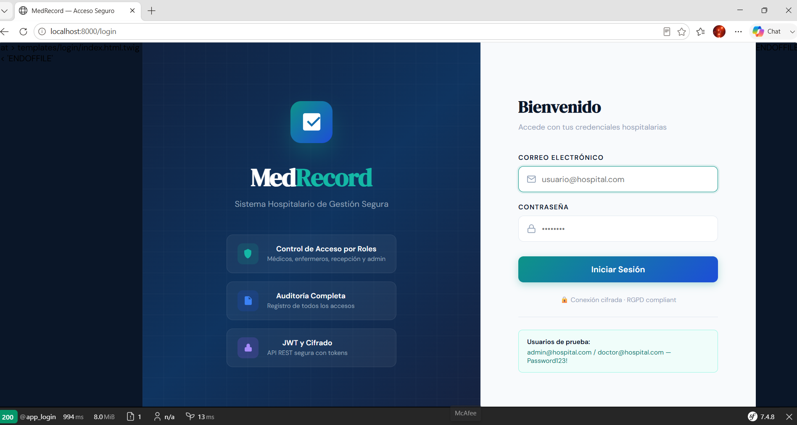
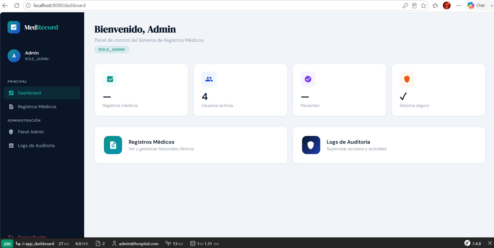
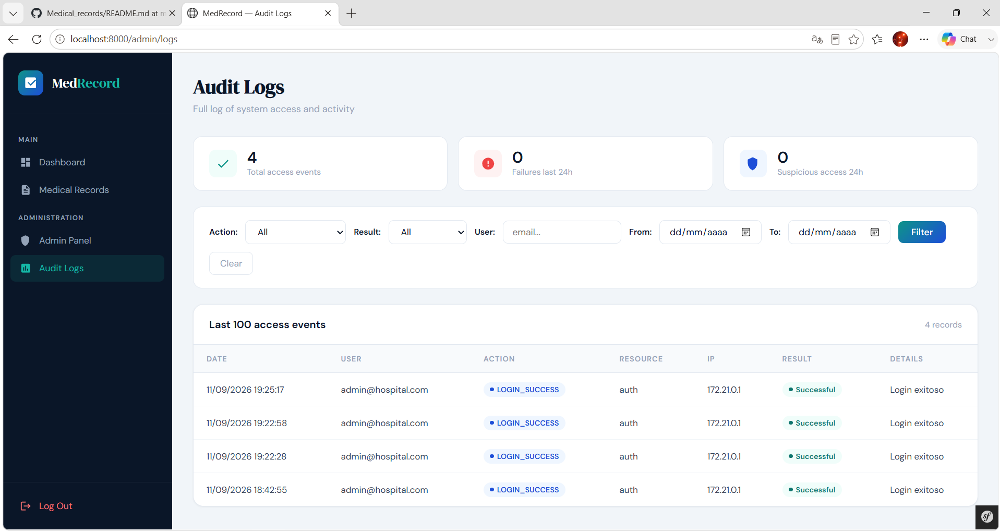

cat > README.md << 'EOF'
# 🏥 Medical Records Management System


A Symfony 7 REST API built to practise secure application design — role-based
access control, JWT authentication, rate limiting and full audit logging for
a hospital records system.

## 📸 Screenshots

| Login | Admin Dashboard | Audit Logs |
|---|---|---|
|  |  |  |

## 🔐 Security Features

This project exists specifically to explore application security in Symfony:

- **Role-Based Access Control (RBAC)** — hierarchical roles: `ADMIN > DOCTOR > NURSE > RECEPTIONIST`
- **Symfony Voters** — granular, per-record access control based on role and ownership
- **JWT Authentication** — stateless auth for the REST API (1-hour token lifetime)
- **Rate Limiting** — max 5 login attempts every 15 minutes
- **Account Lockout** — account locked after 5 consecutive failed logins
- **Audit Logging** — every access logged to the database with IP, user and timestamp
- **CSRF Protection** — on all edit/delete forms
- **Suspicious Access Monitoring** — admin panel showing failed access attempts in the last 24h

## 🛠️ Tech Stack

PHP 8.3 · Symfony 7 · Doctrine ORM · MySQL 8.0 · Lexik JWT Bundle · Docker

## 🚀 Getting Started

The whole app (PHP + MySQL) runs with a single command via Docker:

```bash
git clone https://github.com/SoniaDL90/Medical_records.git
cd Medical_records
docker compose up -d --build
docker compose exec app php bin/console doctrine:migrations:migrate --no-interaction
docker compose exec app php bin/console doctrine:fixtures:load --no-interaction
```

Then open **http://localhost:8000/login** in your browser.

## 👤 Test Users

| Email | Password | Role | Permissions |
|-------|-----------|-----|---------|
| admin@hospital.com | Password123! | ROLE_ADMIN | Read, edit and delete all records |
| doctor@hospital.com | Password123! | ROLE_DOCTOR | Read and edit their own patients |
| nurse@hospital.com | Password123! | ROLE_NURSE | Read all records, limited editing |
| reception@hospital.com | Password123! | ROLE_RECEPTIONIST | Basic patient data only |

## 📡 REST API

**Get a token:**
```bash
curl -X POST http://127.0.0.1:8000/api/login \
  -H "Content-Type: application/json" \
  -d '{"username":"admin@hospital.com","password":"Password123!"}'
```

**Use the token:**
```bash
curl http://127.0.0.1:8000/api/medical-records/ \
  -H "Authorization: Bearer <token>"
```

**Main URLs:**
- Web login: `http://127.0.0.1:8000/login`
- Admin panel: `http://127.0.0.1:8000/admin`
- Audit logs: `http://127.0.0.1:8000/admin/logs`

## 📝 What I Learned

Building this project helped me understand how to design layered authorization
(RBAC combined with Symfony Voters for per-record checks), implement stateless
JWT authentication for an API, and add defensive measures against brute-force
attacks — rate limiting, account lockout and audit logging.
EOF
